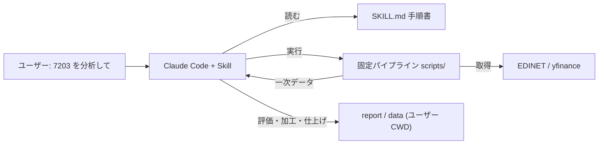
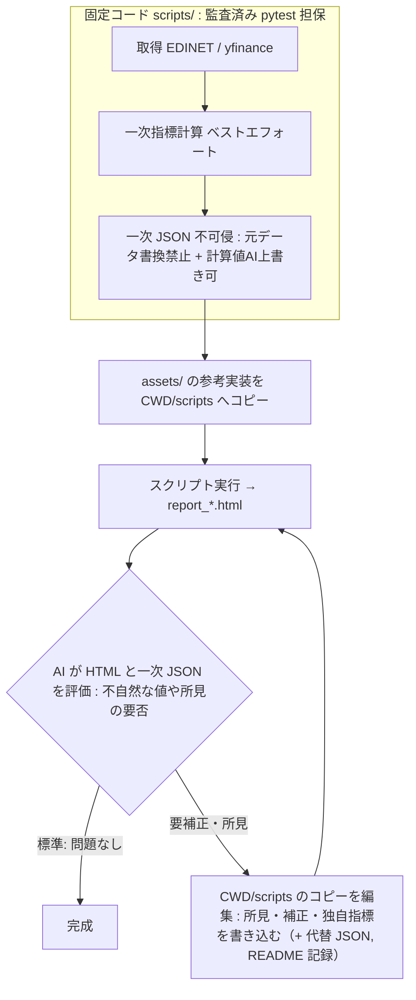
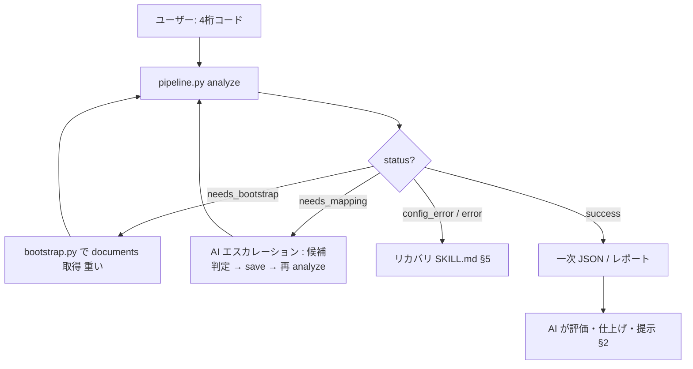
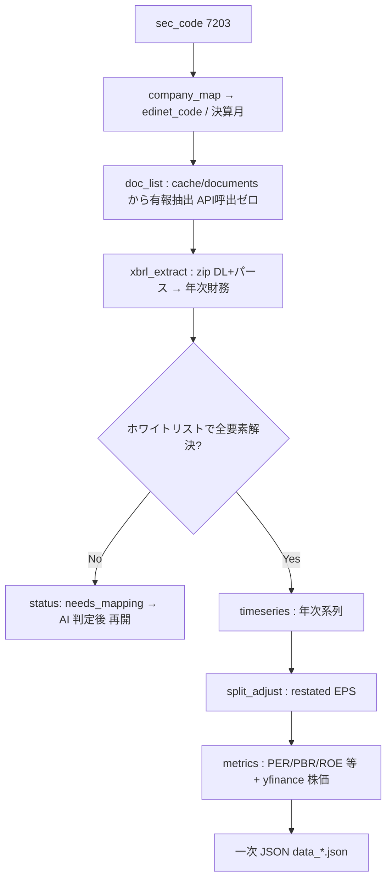
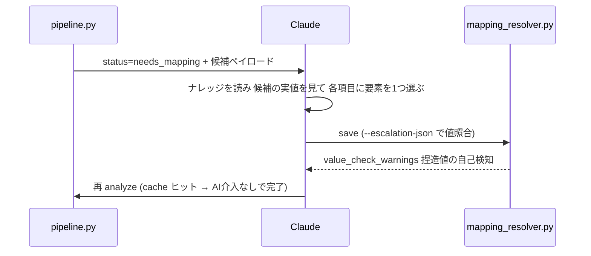

<!-- AI instruction (pinned): このファイルは目標アーキテクチャの正（これから到達すべき設計）を簡潔に示す入口ドキュメント。init_plan.md（初期計画・不可侵）を上書きする現行の正。課題やタスクの管理はしない（それは bugs/ enhancements/ の役割）。大きな設計変更を加えたら本ファイルを更新すること。 -->

# アーキテクチャ概要 (architecture.md)

**japan-stock-analysis Skill** の目標アーキテクチャを、初めてこのプロジェクトにアサインされた開発者にも
分かるよう簡潔に示す。

- **このファイルが示すのは「あるべき設計」**。設計の正としてこの姿を基準にする。
  実装の進捗・個別の課題は `bugs/` `enhancements/` で管理する（本ファイルでは扱わない）。
- **位置づけ**: [init_plan.md](init_plan.md) は初期計画の記録で**不可侵（凍結）**。本ファイルが現行設計の正。
  開発ルールは [AGENTS.md](AGENTS.md)。なお [SKILL.md](skills/japan-stock-analysis/SKILL.md) は設計文書ではなく
  **Skill 配布物の一部**（Claude が実行時に従うエントリ手順書）であり、本ファイルとは別物。

---

## 1. このシステムは何か

日本株（4 桁証券コード）を起点に、**EDINET**（金融庁の開示 API・一次情報）と **yfinance**（株価）から
財務三表・指標・バリュエーション推移を取得し、**HTML レポート**と **JSON データ**を生成する
**Claude Code Agent Skill**。

中核思想は **AI 介在型**であること。日本企業の XBRL は会社・業種・会計基準（IFRS/JGAAP）・年度で
要素や基準が大きく揺れる。これを**コードの固定ロジックだけで吸収せず、AI（Claude）の判断に委ねる**。
**固定コードは決定的に書ける部分（取得・一次計算）に徹し、会社差・例外加工・定性判断・仕上げは AI が担う。**



---

## 2. 責務分界（このアーキテクチャの肝）

固定コードと AI の責務をはっきり分ける。**固定コードは「元データ取得＋一次計算＋不可侵の一次 JSON」まで**。
それ以降の評価・会社固有の加工・雛形外の分析・レポートの仕上げは **AI 裁量**。



レポート生成スクリプトを反復的に仕上げる。**所見や補正は「HTML の後付け」ではなく、レポート生成
スクリプト（CWD/scripts のコピー）に書き込まれ、その実行結果として HTML に織り込まれる**。標準ケースは
初回出力のまま追記なしで完成し、補正・所見が要る場合だけ編集 → 再実行のループを回す。

**ルール**

- **一次 JSON は不可侵**。内部で **元データ（XBRL/株価の生値・書換禁止）** と **計算値（指標・AI 上書き可）** を
  明示分離する。AI は元データを入力に計算値を再計算し、**代替 JSON**（`data_*_adjusted.json`・全量）を出す。
- **AI が作る加工/分析スクリプトは、ユーザー CWD 直下の `./scripts/` に銘柄番号で命名して永続化**し、
  `./scripts/README.md` に記録（再現性・監査性）。日付は付けない。
- **レポート生成は `assets/` の参考実装を CWD/scripts にコピーして使う**。標準ケースはそのまま実行、
  会社固有の補正・雛形外の図表・AI 所見が要るときだけコピーを編集して再実行する。参考実装は無垢のまま残す。
- 補正・所見は**根拠（XBRL の実値・有報の遡及列）に基づき**、推測値を書かない。事実と解釈を分ける。
  所見は断定的な売買推奨を避ける。

---

## 3. 実行フロー

Claude が SKILL.md に沿って `pipeline.py analyze` を呼び、返り値の `status` で分岐する。



| status | 意味 | 対応 |
|---|---|---|
| `success` | 分析完了 | AI が評価・仕上げ・提示 |
| `needs_bootstrap` | documents キャッシュ未整備 | bootstrap（重い） |
| `needs_mapping` | ホワイトリスト外要素あり | AI エスカレーション（§5） |
| `config_error` / `error` | 設定不備・その他 | SKILL.md §5 リカバリ |

---

## 4. データフロー（固定コード部分・1 銘柄）

固定パイプラインは取得から一次 JSON までを担う。



### scripts/ の主なモジュール

| モジュール | 役割 |
|---|---|
| `pipeline.py` | オーケストレーション（`analyze` コマンド・直接実行エントリ） |
| `bootstrap.py` | 過去 N 年の全営業日 documents.json を一括取得（重い初期処理） |
| `company_map.py` / `doc_list.py` | 企業マスタ参照 / documents から有報抽出 |
| `xbrl_extract.py` | XBRL の DL・パース・要素抽出（ホワイトリスト `PATH_A/B_ITEMS`） |
| `mapping_resolver.py` | ホワイトリスト外要素の AI マッピング管理・エスカレーション窓口 |
| `timeseries.py` / `metrics.py` | 年次系列構築 / 指標計算 |
| `split_adjust.py` / `stock_price.py` | restated EPS / yfinance ラッパー |
| `json_export.py` | 一次 JSON 出力 |
| `cache_admin.py` | キャッシュ状態確認・クリア |

> レポート生成（HTML）は `scripts/` ではなく **`assets/` の参考実装**として置き、CWD にコピーして使う（§2）。

---

## 5. AI 介在の要: XBRL 要素マッピング

ホワイトリスト（`xbrl_extract.py` の `PATH_A/B_ITEMS`）で解決できない要素を持つ銘柄
（銀行・保険・通信の業種固有勘定、IFRS 独自要素など）は、**AI がエスカレーションで判定**する。



設計思想（[AGENTS.md](AGENTS.md) §設計思想）:
- コードで網羅しようとしない。会社差は AI 判断に委ねる。
- rationale には候補の**実値のみ**引用（推測値・暗算値を書かない）。
- 取得不能な項目は無理にマッピングせず `unresolved[]` に逃がす（NaN 許容）。

---

## 6. キャッシュ設計

EDINET の `documents.json` API は**日付単位**で全社の提出書類を返す（銘柄/docType のサーバ側絞り込みは
無い）。よってキャッシュの本質単位は **日付** であり、これが bootstrap の重さの理由。

キャッシュは置き場で 2 種類に分ける。**グローバル（Skill 配下）に持つのは bootstrap 由来の全社共通分だけ**。
銘柄固有のキャッシュは成果物と同じ**ユーザー CWD** に置き、「CWD ＝ 1 銘柄分析の作業場」に集約する
（別 CWD で同一銘柄を再分析することは想定しないので、横断共有は不要）。

| キャッシュ | 単位 | 置き場 |
|---|---|---|
| `documents/` | 日付・全社共通 | **グローバル（Skill 配下）**。取得 ~40 分・~600MB |
| `company_map.csv` | 全社共通 | **グローバル（Skill 配下）** |
| `xbrl/` `derived/` `mappings/` `split_adjust/` `prices/` | 銘柄 | **ユーザー CWD**（一次/代替 JSON・スクリプト・レポートと同じツリー） |

> 手動テストでは bootstrap 分（documents/ ＋ company_map）のみ使い回し、銘柄固有分は各 CWD に生成・破棄する
> （[AGENTS.md](AGENTS.md) §手動テスト）。経緯は init_plan.md §3.2 / §3.5（不可侵。現行の正は本ファイル）。

---

## 7. テスト・品質保証

```bash
cd skills/japan-stock-analysis
env/bin/pytest tests/    # ネットワーク不要・fixture 同梱・数秒で全件 PASS
```

- 固定コードの一次計算は pytest で回帰を担保する**監査済みの土台**。実装変更時は必ず通してから commit。
- 検証は**複数社**（IFRS=トヨタ 7203、銀行=8306、JGAAP=東京ガス 9531、通信=NTT 9432 等）で行う。
  単一銘柄での「動いた」は一般化の根拠にしない。
- 手動の実機検証は `manual_test_*/` で行い、所見は各ディレクトリの `review_report.md` にまとめる。

---

## 8. 用語ミニ辞書

| 用語 | 意味 |
|---|---|
| EDINET | 金融庁の電子開示システム。有報等の XBRL を提供 |
| XBRL | 財務報告の構造化フォーマット（要素名・コンテキスト・名前空間で値を持つ） |
| docType=120 | 有価証券報告書（年次） |
| ホワイトリスト | `xbrl_extract.py` が決定的に解決する要素対応表（`PATH_A/B_ITEMS`） |
| エスカレーション | ホワイトリスト外要素を AI が判定する経路（needs_mapping） |
| restated EPS | 最新有報の遡及列から得る分割補正済み EPS（PER 計算に使用） |
| 一次 JSON / 代替 JSON | 固定コードの不可侵出力 / AI 補正後の全量出力 |
| CWD | ユーザーが Skill を起動した作業ディレクトリ（成果物の出力先） |
