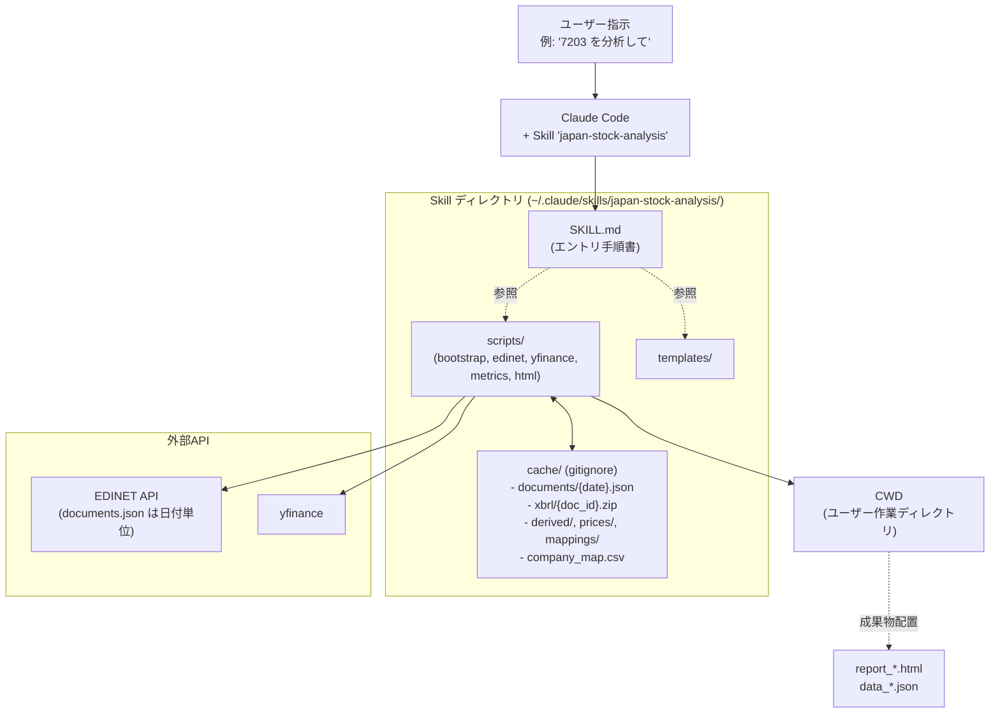

# 日本株 個別分析基盤 - 全体設計とplan

作成日: 2026-05-20
位置付け: pre-researchフェーズの締めとして、本実装に進む前の全体設計と進め方を整理する。

> **本実装の参照ルール**:
> 本planは pre-research 一式と**セットで参照すること**を前提に書かれている。
> 以下は本planに記載していないがpre-researchに実体がある情報の例:
> - `pre-research/edinet/step3a_lxml.py`: XBRLパースの本体（移植元）
> - `pre-research/edinet/data/company_map.csv`: company_map のスキーマ実例
> - `pre-research/edinet/step2_doc_list.py`: secret.json の読み込み方、`fetch_docs` の最小実装と 404 ハンドリング（注: `build_scan_dates` は単一会社・単一決算月用の窓絞り込み関数で、bootstrap では使わない）
> - `pre-research/edinet/step6_html_output.py`: HTML出力の実装サンプル（templates/化前の原型）
> - `pre-research/edinet/verification_results.md`: 検証で踏んだ落とし穴と教訓
> - `pre-research/edinet/xbrl_company_variation.md` §4.4: LLM判定時に渡すべきナレッジ本体
> - `pre-research/edinet/step7_split_adjust.py`（P3.5で新設予定）: 株式分割補正の手法選定根拠
>
> 不明点は **まずpre-research該当ファイルを読む**こと。それでも分からなければユーザーに確認。

---

## 1. ゴールと前提

### ゴール
- 銘柄コード（4桁）を起点に、財務三表・指標・バリュエーション推移を**AIエージェント経由で**取得・分析・可視化できる基盤を作る。
- 最終的な配布形態は **Claude Code向け Agent Skill**（以下、単に「Skill」）。

### 想定利用シーン
- **主**: ユーザーが対話で「7203を分析して」「7203と6758を比較して」と指示し、SkillがデータをフェッチしてHTMLレポートを生成する。
- **副**: 同時に数社（〜10社程度）まで処理できる。多銘柄スクリーニングは対象外（範囲を切る）。

### 設計原則
- pre-researchのStep0〜Step6で得た知見（特にEDINET XBRLパース、株式分割の取り扱い）を本実装にそのまま継承する。
- 一次情報優先：EDINETを主軸、yfinanceは最新株価とPER/PBR用スナップショットの**補完用**。
- ローカルキャッシュは**プレーンテキスト（CSV/JSON）**。SQLiteは使わない。
- キャッシュは **Skill内 `cache/`** に保持（gitignore）。`__file__` 起点の相対パスで解決し、ユーザーの作業ディレクトリに依存させない。
- 成果物（HTML/JSON）は **Claude実行時のCWD（作業ディレクトリ）** に出力。プロジェクトごとに整理しやすくする。
- EDINETの `/documents.json` は日付単位APIなので、キャッシュの中核は **「日付ごとの書類インデックス」**。初回 bootstrap で **過去N年分の全平日**を一括取得する設計（提出ウィンドウで絞らない。理由は後述§3.5）。

### 非ゴール（今回扱わない）
- 多銘柄スクリーニング（PER<15、ROE>10%等の条件抽出）。
- リアルタイム株価、信用残・空売り情報。
- セクター/業種別ベンチマーク。
- J-Quants API（古い・期間短いので不採用）。

### 段階的に実装するもの（初期は対象外、将来Phase）
- **株価チャート（日足/週足/月足）**: yfinanceで取得可能なので、HTML出力に組み込む余地あり。
  ただし初期段階は「財務・指標推移」が主目的なので優先度低。後述の Phase P9 で扱う。
- **XBRL揺れのAI動的解決**: 業種・会計基準・企業独自要素の自動マッピング。後述「§4.5 XBRL揺れへの対処方針」参照。

---

## 2. アーキテクチャ概観



### レイヤ分け

| レイヤ | 中身 | 場所 |
|--------|------|------|
| エントリ | SKILL.md（手順書）。Claudeが読んでステップを順に実行 | Skill内 |
| 取得 | EDINET XBRL取得・パース、yfinance呼び出し | Skill内 scripts/ |
| 加工 | timeseries構築、metrics計算（PER/PBR含む） | Skill内 scripts/ |
| 出力 | JSON保存、HTMLレンダリング | Skill内 scripts/ + templates/ |
| キャッシュ | documents_index、XBRL zip、company_map、派生CSV、mappings | **Skill内 cache/**（gitignore） |
| 成果物 | report_*.html、data_*.json | **CWD（作業ディレクトリ）** |

### データフロー（1銘柄の場合）

```
sec_code (例: 7203)
  │
  ├─[前提]→ cache/documents/*.json が bootstrap 済（無ければ自動bootstrap）
  │
  ├─[Step1相当]→ company_map.csv 参照 → edinet_code, 決算月を解決
  ├─[Step2相当]→ documents/*.json から該当銘柄×docType=120 を抽出 (API呼び出しゼロ)
  ├─[Step3相当]→ cache/xbrl/{doc_id}.zip をDL（既存ならスキップ）→ パース → 年次dict
  ├─[Step4相当]→ cache/derived/timeseries_{sec_code}.csv
  ├─[Step5相当]→ yfinance呼び出し → cache/derived/metrics_{sec_code}.csv
  └─[Step6相当]→ CWD/report_{sec_code}.html + CWD/data_{sec_code}.json
```

---

## 3. ディレクトリ構成案

### 3.1 本プロジェクト（FinanceSource）の構成（提案）

```
FinanceSource/
├── README.md
├── plan.md                       ← 本ファイル
├── docs/                         (設計・調査ドキュメント)
│   └── edinet/                   (既存)
├── pre-research/                 (既存・凍結。本実装後もリファレンスとして残す)
│   ├── research_summary.md
│   └── edinet/                   (Step0〜Step6スクリプト群、検証結果)
└── skills/                       (Skillの開発ディレクトリ)
    └── japan-stock-analysis/     (単一統合Skill本体。配布単位)
```

ポイント:
- `pre-research/` は**凍結**して残す。本実装のリファレンス、教訓の出所として参照する。
- `skills/japan-stock-analysis/` がSkill本体。配布時はこのディレクトリを丸ごとClaude Codeの `~/.claude/skills/` 配下にコピー（またはシンボリックリンク）する想定。
- 開発用の独立 `workspace/` は**廃止**。キャッシュも成果物もSkill運用ルールに従う（次節）。

### 3.2 キャッシュと出力の配置方針

**前提**: EDINETの `/documents.json` API は**日付単位**でその日に提出された全社の書類一覧を返す（仕様: pre-research [step2_doc_list.py](pre-research/edinet/step2_doc_list.py) 参照）。
銘柄絞り込みやdocTypeCode絞り込みはサーバ側にない。
したがってキャッシュの本質的な単位は **「日付ごとの書類インデックス」** であり、銘柄単位ではない。

| 種別 | 単位 | 性質 | 配置 |
|------|------|------|------|
| company_map.csv | 全社共通 | 全上場企業のEDINETコード⇔銘柄コード対応 | Skill内 `cache/` |
| **documents_index** | **日付単位** | API直接結果 `documents_{YYYY-MM-DD}.json` | **Skill内 `cache/documents/`**（中核キャッシュ） |
| xbrl/{doc_id}.zip | docID単位 | XBRL本体（不変） | Skill内 `cache/xbrl/` |
| timeseries/metrics/{sec_code}.csv | 銘柄単位 | 派生物（再計算可能） | Skill内 `cache/derived/` |
| prices/{sec_code}.csv | 銘柄単位 | yfinance日足（日次更新） | Skill内 `cache/prices/` |
| mappings/{sec_code}.json | 銘柄単位 | XBRL要素マッピング（AI判定結果含む） | Skill内 `cache/mappings/` |
| split_adjust/{sec_code}.json | 銘柄単位 | 最新報告書から取得した restated EPS マッピング（pre-research Step7 参照） | Skill内 `cache/split_adjust/` |
| 出力（HTML/JSON） | 銘柄単位 | レポート成果物 | **CWD（Claude実行時の作業ディレクトリ）** |

出力をCWDにする理由:
- プロジェクトごとに成果物を整理しやすい（投資検討プロジェクトAとBで混ざらない）
- Skill内に貯めるとSkillディレクトリが肥大化する
- ユーザーが `ls` ですぐ見つけられる

### 3.3 Skill内部の構成（詳細案）

```
japan-stock-analysis/
├── SKILL.md                          # エントリ手順書（Claudeが読む）
├── README.md                         # 人間向け説明
├── requirements.txt
├── .gitignore                        # cache/ を除外（zip群やJSON群をgit外に）
├── secret.json                       # APIキー（gitignore済）
├── scripts/
│   ├── __init__.py
│   ├── paths.py                      # __file__ ベースの相対パス解決（cache/output場所の集約）
│   ├── config.py                     # APIキー読込
│   ├── bootstrap.py                  # ★初回一括取得スクリプト（過去N年の全平日 documents_index をスキャン）
│   ├── company_map.py                # Step1相当: 企業マスタCSV
│   ├── doc_list.py                   # Step2相当: documents_index から銘柄分を抽出（API呼び出し不要）
│   ├── xbrl_extract.py               # Step3相当: XBRL DL+パース (Step3aを継承)
│   ├── mapping_resolver.py           # XBRL要素マッピング解決 (キャッシュ管理＋LLMエスカレーション窓口)
│   ├── timeseries.py                 # Step4相当: 年次time-series構築
│   ├── metrics.py                    # Step5相当: 指標計算 (PER/PBR含む)
│   ├── stock_price.py                # yfinance ラッパー (キャッシュ層)
│   ├── split_adjust.py               # 株式分割補正 (Step5の教訓を実装)
│   ├── html_report.py                # Step6相当: HTML生成 (財務+指標)
│   ├── chart_price.py                # 株価チャート生成 (将来Phase / yfinance日足・週足・月足)
│   ├── cache_admin.py                # キャッシュの info / clear 操作
│   └── pipeline.py                   # 上記を順に呼び出すオーケストレータ
├── templates/
│   └── report_template.html          # 単一銘柄/比較共通テンプレート
├── cache/                            # ★Skill内キャッシュ（gitignore）
│   ├── company_map.csv
│   ├── documents/
│   │   └── documents_{YYYY-MM-DD}.json
│   ├── xbrl/
│   │   └── {doc_id}.zip
│   ├── derived/
│   │   ├── timeseries_{sec_code}.csv
│   │   └── metrics_{sec_code}.csv
│   ├── prices/
│   │   └── {sec_code}.csv
│   ├── mappings/
│   │   └── {sec_code}.json
│   └── split_adjust/
│       └── {sec_code}.json
└── tests/
    ├── test_xbrl_extract.py
    ├── test_metrics.py
    └── fixtures/                     # 既知の銘柄(7203, 6758)のXBRLサンプル
```

### 3.4 パス解決方針

`scripts/paths.py` に集約:

```python
# 概念コード
from pathlib import Path

SKILL_ROOT = Path(__file__).resolve().parent.parent   # scripts/ の親 = Skillルート
CACHE_DIR = SKILL_ROOT / "cache"
DOCUMENTS_DIR = CACHE_DIR / "documents"
XBRL_DIR = CACHE_DIR / "xbrl"
DERIVED_DIR = CACHE_DIR / "derived"
PRICES_DIR = CACHE_DIR / "prices"
MAPPINGS_DIR = CACHE_DIR / "mappings"
COMPANY_MAP = CACHE_DIR / "company_map.csv"

def output_dir() -> Path:
    """成果物の出力先 = 現在の作業ディレクトリ。
    Claude実行時のCWDは「ユーザーがそのプロジェクトで作業中のディレクトリ」になる前提。
    """
    return Path.cwd()
```

これにより:
- Skill内スクリプトは絶対パスをハードコードせず、`__file__` 起点で全パス解決
- ユーザーがSkillをどこに置こうがシンボリックリンクで配置しようが破綻しない
- 成果物はCWDなので、`cd ~/investment/2026Q2 && claude` してから分析実行すれば、そのフォルダにHTMLが落ちる

### 3.5 ブートストラップスクリプトの位置付け

`scripts/bootstrap.py` は**初回または定期更新時に走らせる重い処理**を集約:

```bash
# 過去10年分の全平日 documents_index をスキャンしてキャッシュ
python3 ${CLAUDE_SKILL_DIR}/scripts/bootstrap.py fetch-documents --years 10

# 企業マスタの再取得
python3 ${CLAUDE_SKILL_DIR}/scripts/bootstrap.py refresh-company-map

# 一気通貫（初回セットアップ）
python3 ${CLAUDE_SKILL_DIR}/scripts/bootstrap.py init
```

呼び方:
- **ユーザーが手動**: 初回セットアップ時、または週次/月次の更新時
- **Skill経由**: 「7203を分析して」と言われた時、必要な documents_index が無ければ SKILL.md の手順に従い Claude が自動でbootstrapを実行

`bootstrap.py` のスキャン範囲方針:
- **過去N年分の全平日**を対象（Sat/Sun は EDINET が 404 を返すのでスキップ）
- pre-research Step2 の `build_scan_dates` は **単一会社・単一決算月用**の窓絞り込みであり、bootstrap の「全社×全書類タイプを一括取得」用途には合わない（年次報告書しか狙わない設計だった）。bootstrap では四半期/半期報告書・有報訂正・大量保有報告書なども将来扱う余地を残し、シンプルに全平日を走査する
- 過去10年分 → 概算 2,500 API呼び出し（平日 ≒ 250日/年 × 10年。1秒/req で約40分）
- EDINET API は公式仕様書・公式ガイドのいずれにもレート制限の数値記載なし（pre-research [edinet_api_overview.md](pre-research/edinet/edinet_api_overview.md) §レート制限）。本検証では **1秒間隔で安定動作**を実証済み。chunk 分割は「サーバ負荷を意識した段階実行」と「中断/再開」のために提供（金銭コストや明示上限のためではない）
- 過去日付の documents_index は不変なので、二度目以降は cache/documents/{date}.json が存在すればスキップ（差分取得）

### 3.6 キャッシュポリシー

| キャッシュ | 期限 | 理由 |
|----------|-----|------|
| documents_{date}.json | **永続** | 過去日付の提出書類は不変 |
| xbrl/{doc_id}.zip | **永続** | XBRL本体は不変 |
| company_map.csv | 7日 | 新規上場・廃止を反映 |
| derived/* | documents/xbrl から再計算可能なので、不整合時は手動削除 | |
| prices/{sec_code}.csv | 1日 | 株価は日次更新 |
| mappings/{sec_code}.json | 永続 | AI判定結果は明示削除でのみ再生成 |
| split_adjust/{sec_code}.json | 「最新報告書 docID と異なる場合」に再取得 | restated EPS は最新報告書発行のたびに過去5年が更新されるため、最新 docID をキャッシュキーにする |

直近の documents_{date}.json については、**「今日から3ヶ月以内」の範囲は新しい書類が随時提出される**ため、bootstrap時には常に上書き取得する（過去日付は既存スキップ）。

---

## 4. Skillの設計方針

### 4.1 単一Skill構成

ユーザー判断に従い、**1つの統合Skill `japan-stock-analysis`** とする。
理由:
- 利用シーンが「1銘柄〜数社」に絞られており、分割するとSkill間通信のオーバーヘッドが大きい。
- データ取得→加工→可視化までが一連の処理で、共有ロジック（パス解決、キャッシュ、株式分割補正）が多い。
- スクリーニング等への将来拡張は別Skillとして切り出せばよい。

### 4.2 SKILL.md（エントリ手順書）の構成案

SKILL.mdはClaudeが読んで実行するため、**明確な手順 + 想定入力/出力 + エラー処理ルール**で書く。

セクション構成:
1. **目的と前提**: 何ができて何ができないか
2. **入力受付ルール**: ユーザー発話から `sec_code` の抽出方法、複数指定の扱い
3. **環境準備**: APIキーの確認、`requirements.txt` インストール、初回 bootstrap 実行判定
4. **実行手順**: `pipeline.py` / `bootstrap.py` の呼び出し方、引数、ログの読み方
5. **失敗時のリカバリ**: ネットワーク失敗、レート制限、XBRL解析失敗の対処
6. **出力の解釈**: CWDに生成されたHTMLとJSONの説明、ユーザーへの提示テンプレ
7. **既知の制限事項**: 株式分割問題、月次決算ラベル等（pre-researchから継承）

### 4.3 主要なPython エントリ仕様

**呼び出し方針** ([Agent Skills 公式](https://code.claude.com/docs/en/skills)):
- Claude Code は SKILL.md 実行時に `${CLAUDE_SKILL_DIR}` 環境変数を自動セットする（その Skill の SKILL.md が置かれているディレクトリの絶対パス）
- スクリプトは **絶対パスで直接実行**（`python -m` は使わない）
- これにより **CWDはユーザーのプロジェクトディレクトリのまま**で、スクリプトは Skill 配下を絶対パスで参照できる → 成果物は CWD、キャッシュは Skill 内、という配置がそのまま成立する

```bash
# 通常分析（キャッシュ済前提）
python3 ${CLAUDE_SKILL_DIR}/scripts/pipeline.py analyze --sec-code 7203
python3 ${CLAUDE_SKILL_DIR}/scripts/pipeline.py analyze --sec-code 7203 6758    # 比較レポートも自動生成

# オプション
#   --force-refresh         該当銘柄の派生キャッシュを破棄して再計算
#   --no-yfinance           yfinanceスキップ（財務のみ完走）
#   --output-dir <path>     CWD以外を出力先にしたい場合の上書き

# 初回 bootstrap（重い処理。ユーザー or Claudeが必要時に実行）
python3 ${CLAUDE_SKILL_DIR}/scripts/bootstrap.py init                           # 一気通貫
python3 ${CLAUDE_SKILL_DIR}/scripts/bootstrap.py fetch-documents --years 10     # documents_index のみ
python3 ${CLAUDE_SKILL_DIR}/scripts/bootstrap.py fetch-documents --years 10 --chunk 0/3  # 3分割の0番目だけ
python3 ${CLAUDE_SKILL_DIR}/scripts/bootstrap.py refresh-company-map

# キャッシュ操作（cache_admin サブコマンド）
python3 ${CLAUDE_SKILL_DIR}/scripts/cache_admin.py info                         # 全種類の件数・サイズ・最終更新日を表示
python3 ${CLAUDE_SKILL_DIR}/scripts/cache_admin.py info --sec-code 7203         # 7203関連の派生キャッシュだけ表示

# 削除（種類別）
python3 ${CLAUDE_SKILL_DIR}/scripts/cache_admin.py clear --derived              # timeseries/metrics を全削除（再計算で復元可）
python3 ${CLAUDE_SKILL_DIR}/scripts/cache_admin.py clear --prices               # yfinance キャッシュを全削除
python3 ${CLAUDE_SKILL_DIR}/scripts/cache_admin.py clear --mappings             # XBRL要素マッピングを全削除（AI判定をやり直したい時）
python3 ${CLAUDE_SKILL_DIR}/scripts/cache_admin.py clear --documents --confirm  # documents_index を全削除（API再取得が必要、要 --confirm）
python3 ${CLAUDE_SKILL_DIR}/scripts/cache_admin.py clear --xbrl --confirm       # XBRL zip を全削除（API再取得が必要、要 --confirm）

# 削除（銘柄指定）
python3 ${CLAUDE_SKILL_DIR}/scripts/cache_admin.py clear --sec-code 7203                          # 7203の derived/prices/mappings をまとめて削除
python3 ${CLAUDE_SKILL_DIR}/scripts/cache_admin.py clear --sec-code 7203 --types derived,prices   # 種類を絞る

# 削除（全削除、開発時や深刻な不整合時）
python3 ${CLAUDE_SKILL_DIR}/scripts/cache_admin.py clear --all --confirm        # documents/xbrl 含めて全削除
```

> **開発時の補足**: pytest 等での import 解決のため、各 CLI スクリプトは `python -m scripts.X` 形式でも動くようにしてある（先頭で `__package__` が空のときに sys.path を調整）。本番運用と SKILL.md 上は常に `${CLAUDE_SKILL_DIR}` 絶対パス方式を使う。

削除の安全弁:
- `documents/` `xbrl/` の削除は **API再取得コストが高い**ので `--confirm` フラグ必須
- `derived/` `prices/` `mappings/` は再生成が安価なので `--confirm` 不要
- `--sec-code` 指定時は派生3種（derived/prices/mappings）のみ対象。XBRL zipは削除しない（他銘柄と共有しないので無駄にAPI再取得になるのを防ぐ意味は薄いが、docID単位なので「銘柄」キーで紐付かないのが理由）
- `analyze --force-refresh` は内部的に `cache_admin clear --sec-code XXX --types derived,prices` 相当を実行してから analyze する糖衣構文

戻り値（標準出力にJSON）:
```json
{
  "status": "success",
  "sec_codes": ["7203"],
  "outputs": {
    "html": "<CWD>/report_7203.html",
    "data_json": {"7203": "<CWD>/data_7203.json"},
    "per_code": [
      {
        "sec_code": "7203",
        "fiscal_years": ["2025-03-31"],
        "timeseries_csv": "<SKILL_ROOT>/cache/derived/timeseries_7203.csv",
        "metrics_csv": "<SKILL_ROOT>/cache/derived/metrics_7203.csv",
        "split_adjust_source_doc_id": "S100VWVY",
        "warnings": []
      }
    ]
  },
  "cache_dir": "<SKILL_ROOT>/cache",
  "warnings": ["[7203] yfinance price for 2023-03-31 fell back to 2023-03-30 close"]
}
```

> `data_json` の中身（`data_{sec_code}.json` の詳細スキーマ）は [skills/japan-stock-analysis/docs/json_schema.md](skills/japan-stock-analysis/docs/json_schema.md) 参照。

bootstrap未完了時のエラー表現例:
```json
{
  "status": "needs_bootstrap",
  "reason": "cache/documents/ にカバーされていない日付が含まれます",
  "missing_window": "2024-06-15 〜 2024-07-07",
  "suggested_command": "python3 ${CLAUDE_SKILL_DIR}/scripts/bootstrap.py fetch-documents --years 10"
}
```
SKILL.md側でこの応答を見たら、Claudeがユーザーに確認の上で bootstrap を実行する手順を明記する。

### 4.4 XBRL揺れへの対処方針（ホワイトリスト × AI動的解決のハイブリッド）

pre-researchの [xbrl_company_variation.md](pre-research/edinet/xbrl_company_variation.md) で整理した通り、
XBRL要素名の差異は **「小さい違い」と「大きい違い」** の2層に分かれる。

| 違いの種類 | 例 | 対処 |
|----------|-----|------|
| 小（既知の有限パターン） | 売上要素名のIFRS vs 日本基準、有利子負債の加算構成 | **scripts内のホワイトリスト**で吸収（pre-research Step3aの方式を継承） |
| 大（事前列挙が困難） | 業種固有勘定科目（銀行・保険）、企業独自拡張要素 | **AI判定にエスカレーション**＋判定結果を永続キャッシュ |

#### 実装アーキテクチャ（案）

```
sec_code 入力
   │
   ├─[1] ホワイトリストで自動抽出を試行
   │        成功 → そのまま timeseries 構築へ
   │        失敗 → ↓
   │
   ├─[2] 企業別マッピング設定を確認
   │        cache/mappings/{sec_code}.json があれば → それを使う
   │        なければ → ↓
   │
   └─[3] LLM判定にエスカレーション
            ・XBRLから「未マッピング要素名一覧」と「サンプル値」を抽出
            ・SKILL.md内に書かれたナレッジ（XBRL名前空間・context解釈・
              業種別候補要素の解説。元ネタは xbrl_company_variation.md §4.4）
              を併せてClaudeに渡し、要素マッピングを判定させる
            ・結果は cache/mappings/{sec_code}.json に保存（次回はステップ2でヒット）
            ・判定の根拠（どの要素名を選んだか、なぜか）を JSON にメモとして残す
```

#### キャッシュフォーマット案（`cache/mappings/{sec_code}.json`）

```json
{
  "sec_code": "8306",
  "company_name": "三菱UFJフィナンシャル・グループ",
  "accounting_standard": "JGAAP",
  "industry_category": "bank",
  "resolved_at": "2026-05-20T12:00:00",
  "resolved_by": "llm",
  "mappings": {
    "NetSales": {
      "element": "jppfs_cor:OrdinaryIncome",
      "rationale": "銀行業では経常収益が売上に相当する。業種固有ナレッジに従い選定。"
    },
    "OperatingIncome": { ... },
    ...
  },
  "unresolved": []
}
```

#### Skillの責務分担

- **scripts/xbrl_extract.py**: ホワイトリストでの自動抽出（決定的・高速）。失敗した要素は `unresolved` として返す。
- **scripts/mapping_resolver.py**（新規）: `unresolved` があれば mappings キャッシュを確認、なければエスカレーション要求を返す。
- **SKILL.md**: エスカレーション時、Claude自身がXBRL要素名一覧と§4.4のナレッジを見て判定し、`scripts/mapping_resolver.py save` で結果をキャッシュに保存する手順を明記。

これにより:
- 既知の大企業（IFRS製造業）はホワイトリストで決定的に処理
- 銀行・保険・独自業種に出会ったときは初回のみAI介入、以降はキャッシュで高速化
- LLMに渡すナレッジ（XBRL名前空間の意味、context解釈ルール、業種別の既知候補要素）は [xbrl_company_variation.md §4.4](pre-research/edinet/xbrl_company_variation.md) を本実装時にSkillへ移植

#### 検証時のスコープ

初期段階（Phase P2〜P6）は**ホワイトリストの範囲内で動く銘柄（トヨタ・ソニー含むIFRS製造業大企業）に限定**して開発を進める。
AIエスカレーションの実装は **Phase P8（SKILL.md整備）** で組み込み、銀行業1社を追加してエスカレーション動作を検証する。

### 4.5 pre-researchからの継承

| pre-research | Skill側の対応 | 改善点 |
|--------------|---------------|--------|
| step0_verify.py | scripts/config.py + scripts/paths.py に統合 | CLI化しなくてよい |
| step1_company_map.py | scripts/company_map.py + bootstrap.py | bootstrap一括処理に統合 |
| step2_doc_list.py の `scan` ループ | scripts/bootstrap.py へ移管 | **過去N年の全平日を一括キャッシュする方式に変更**。`build_scan_dates`（決算月窓絞り）も銘柄指定スキャンも廃止 |
| step2_doc_list.py の `load_company` / docID抽出 | scripts/doc_list.py | **キャッシュ済 documents から抽出するだけの軽量関数**に変更（APIアクセスなし） |
| step3a_lxml.py | scripts/xbrl_extract.py | **そのまま継承**（実証済み） |
| step4_timeseries.py | scripts/timeseries.py | step3aへの依存はそのまま |
| step5_metrics.py | scripts/metrics.py + split_adjust.py | **株式分割補正を実装**（Step5の宿題）。実装手法は新設 **step7_split_adjust.py** の検証結果に従う |
| **step7_split_adjust.py（新設）** | scripts/split_adjust.py の手法選定根拠 | (a) restated EPS / (b) yfinance.Ticker.splits を Sony 6758 等で並行検証。P4 着手前提条件 |
| step6_html_output.py | scripts/html_report.py + templates/ | テンプレートを外出し |

---

## 5. 開発の進め方

### フェーズ分け

| Phase | 目的 | 完了条件 |
|-------|------|---------|
| **P1: 骨組み** | Skillディレクトリ作成、SKILL.md骨子、`paths.py` で `__file__` ベース解決、空のscripts群 | `claude` 起動時にSkillが認識される |
| **P2: bootstrap実装** | `scripts/bootstrap.py` で全社×過去N年の documents_index と company_map をスキャン取得 | `python3 ${CLAUDE_SKILL_DIR}/scripts/bootstrap.py init` が完走、`cache/documents/` に過去10年分が貯まる |
| **P3: 分析ロジック移植** | step1〜step6を `scripts/` に移植、`doc_list.py` は documents キャッシュから抽出する形に書き換え | `python3 ${CLAUDE_SKILL_DIR}/scripts/pipeline.py analyze --sec-code 7203` が任意 CWD から成功し、CWDにHTMLとJSONが出る |
| **P3.5: pre-research Step7（株式分割補正の手法検証）** | yfinance `Ticker.splits` の挙動と (a) restated EPS / (b) splits 比率の2手法を Sony 6758 + 他1〜2銘柄で並行検証 | `pre-research/edinet/step7_split_adjust.py` 完成、`verification_results.md` に両手法の PER 一致状況・5年超期間のカバー範囲・分割逆行等のエッジケース挙動が記録される。P4 採用手法の決定根拠となる |
| **P4: 株式分割補正** | P3.5 の検証結果に基づき `scripts/split_adjust.py` を実装 | 6758でPERが妥当な値（10〜30倍程度）になる |
| **P5: HTML/JSONテンプレ化** | templates/ 外出し、JSON出力フォーマット確定 | スキーマ文書化 |
| **P6: エラー処理・キャッシュ管理** | ネットワーク失敗、レート制限、bootstrap未完了検出、`needs_bootstrap` 応答、`cache_admin info/clear` 実装 | 既知の異常系で落ちずに警告 or リカバリ手順提示／キャッシュの可視化と種類別削除が可能 |
| **P7: テスト** | fixtureベースの単体テスト追加 | `pytest` がCIで通る |
| **P8: SKILL.md整備＋AIエスカレーション** | Claude視点での手順書を詰める／mapping_resolver と SKILL.md でのAI判定フロー実装 | 初見のClaudeが迷わず実行できる／銀行業1社で初回AI判定→キャッシュヒット動作確認 |
| **P9: 通し動作確認** | fresh環境で通し動作（bootstrapから分析まで） | 5銘柄（IFRS製造業＋日本基準＋銀行業含む）でレポート生成成功 |
| **P10（将来）: 株価チャート** | yfinance日足/週足/月足を取得しHTMLレポートに統合 | 1HTML内で「財務推移」「指標推移」「株価チャート（時間軸切替）」が並ぶ |

### 進め方の原則

- **段階的検証**: 各Phaseで「動く成果物」を作る。設計だけ先行させない。
- **pre-researchの教訓を尊重**: 特にStep5の株式分割問題は、コードコメントとSKILL.mdの両方に明記。
- **テストは銘柄固定**: トヨタ(7203, 3月決算・分割なし)とソニー(6758, 3月決算・分割あり)を恒久fixtureに。
- **依存追加は最小**: 現状 `requests, lxml, pandas, yfinance, plotly` で十分なはず。新規追加時は理由をコミットメッセージに残す。

### 最初に決めること（次のセッション以降）

1. プロジェクトルートに `skills/japan-stock-analysis/` を切るか、別リポにするか
2. EDINET APIキーの読み込み方法（既存 `secret.json` を継承するか、`.env` にするか、Skill配下に置くか）
3. HTML出力で plotly を CDN参照ではなく inline 埋め込みのまま維持するか（オフライン閲覧の継続要件）
4. JSONスキーマの確定（PhaseP5で詰める）
5. AIエスカレーション時のClaudeへの渡し方（pipeline側で「未解決要素一覧 + ナレッジ」を標準出力に吐いてSKILL.mdの手順に従いClaudeが解決するフロー、で確定するか）
6. 株価チャートの時間軸切替UI方針（タブ切替 vs Plotly range selector、P10で詰める）
7. bootstrap の現実的なスキャン時間（10年×全平日 ≒ 2,500 req × 1秒間隔 ≒ 42分。明示的なレート上限は公式に記載なし。中断したい場合 chunk K/M で部分実行可能）

---

## 6. リスクと対応

| リスク | 影響 | 対応 |
|--------|------|------|
| EDINET APIレート制限（1日100req） | bootstrapが1日で終わらない（10年で約2,500req） | `bootstrap fetch-documents --chunk N/M` で分割実行、進捗を `cache/documents/` の存在で判定可能にする。既存ファイルはスキップする差分取得設計 |
| yfinance仕様変更でいきなり壊れる | PER/PBR取得不可 | `--no-yfinance` フラグで財務のみで完走可能にする |
| 株式分割補正の未実装 | PER/PBRが誤る | P4で必ず実装。完了までは警告メッセージを出す |
| XBRL構造の銘柄ごとの揺れ | パース失敗 | §4.4の「ホワイトリスト × AI動的解決」ハイブリッドで対応。未知要素は LLM エスカレーション→mapping cache に永続化 |
| AI判定結果の誤マッピング | 指標値が誤る | mapping cache に判定根拠を残し、JSON出力で `resolved_by: llm` を明示。レポート上で警告表示し人間レビューを促す |
| cache肥大化（XBRL zip群） | Skill配布物のサイズ膨張 | `.gitignore` で除外、配布時は cache を含めない（fresh環境では bootstrap から走る） |
| bootstrap未完了で分析実行 | 古い銘柄の年度が欠ける | `needs_bootstrap` 応答でSKILL.md側でClaudeが検出し、ユーザーに確認の上でbootstrap実行 |

---

## 7. 参考

- 既存: `pre-research/research_summary.md` (情報源比較)
- 既存: `pre-research/edinet/verification_results.md` (Step1〜6の検証結果と教訓)
- 既存: `pre-research/edinet/xbrl_company_variation.md` (XBRL構造の揺れ)
- 既存: `pre-research/edinet/edinet_api_overview.md` (API仕様サマリ)
