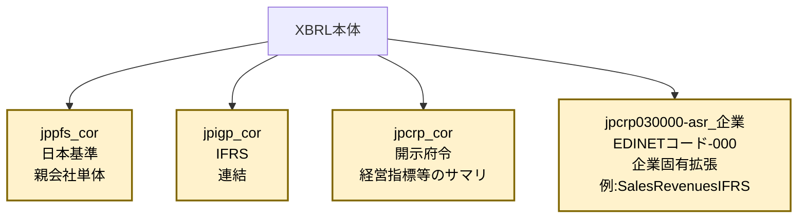
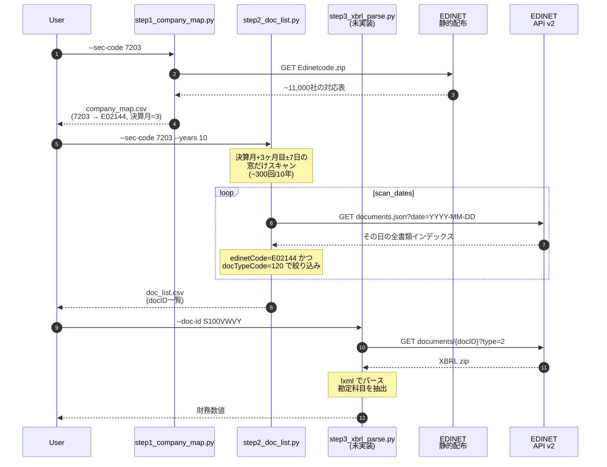

# EDINET API v2 概観

> 「結局このAPIで何が取れるのか」を把握するためのリファレンス。
> 公式仕様書: [references/edinet/ESE140206.pdf](../../references/edinet/ESE140206.pdf)

---

## EDINETとは

金融庁が運営する **電子開示システム**（Electronic Disclosure for Investors' NETwork）。上場企業が提出する**有価証券報告書・四半期報告書・大量保有報告書**などの法定開示書類を電子的に公開している。

APIは **v2** が現行（v1は2024年12月廃止）。

---

## 全体像

```mermaid
flowchart LR
    SC[証券コード 7203]

    ZIP[Edinetcode.zip<br/>静的配布・キー不要<br/>disclosure2dl.edinet-fsa.go.jp]
    EC[EDINETコード E02144]

    EP1["/api/v2/documents.json<br/>書類一覧API・キー要<br/>disclosure.edinet-fsa.go.jp"]
    EP2["/api/v2/documents/&#123;docID&#125;<br/>書類取得API・キー要<br/>disclosure.edinet-fsa.go.jp"]

    RAW[1日分の全書類インデックス<br/>約460件・約430KB]
    FILTER{{クライアント側で絞り込み<br/>edinetCode == E02144<br/>docTypeCode == 120}}
    IDX[対象書類のインデックス<br/>docID・期間・各種フラグ]

    XBRL[XBRL zip<br/>財務数値・タクソノミ]
    PDF[PDF<br/>人間が読む書類]
    CSV[CSV<br/>主要勘定科目抜粋]

    SC -->|入力| ZIP
    ZIP -->|引く| EC
    EP1 -->|date=YYYY-MM-DD<br/>を入力| RAW
    RAW --> FILTER
    EC -.絞り込みキー.-> FILTER
    FILTER --> IDX
    IDX -->|docID を入力| EP2
    EP2 -->|type=1| XBRL
    EP2 -->|type=2| PDF
    EP2 -->|type=5| CSV

    classDef static fill:#b3d9ff,stroke:#003d80,stroke-width:2px,color:#000
    classDef api fill:#ffd699,stroke:#804000,stroke-width:2px,color:#000
    classDef data fill:#d9d9d9,stroke:#333,stroke-width:2px,color:#000
    classDef user fill:#ffffff,stroke:#000,stroke-width:2px,color:#000
    classDef logic fill:#fff2cc,stroke:#806600,stroke-width:2px,color:#000
    class SC user
    class ZIP static
    class EP1,EP2 api
    class EC,RAW,IDX,XBRL,PDF,CSV data
    class FILTER logic
```



**重要なポイント**:
- ドメインが2つある: `disclosure2dl.`（青）は静的配布（キー不要）、`disclosure.`（橙）は本体API（キー要）
- **EP1の入力は `date` のみ**。EDINETコードや書類種別はサーバー側では絞れず、レスポンス（1日分・全企業の約460件）を**クライアント側で絞り込む**
- 書類一覧API（EP1）と書類取得API（EP2）は**別物**で、両方を組み合わせて使う
- 「企業ごと一覧」のような便利エンドポイントは**存在しない**

---

## エンドポイント一覧

### 1. 書類一覧API `/api/v2/documents.json`

**用途**: 指定した日付に提出された全書類のインデックスを取得。

**パラメータ**（公式仕様書 §3-1-1 で確認済み・これ以外なし）:

| 名前 | 必須 | 内容 |
|------|:---:|------|
| `date` | ✅ | 提出日 `YYYY-MM-DD` |
| `type` | – | `1`=メタデータのみ / `2`=フル情報（既定=1） |
| `Subscription-Key` | ✅ | APIキー |

**制約**:
- **企業や書類種別でのフィルタは不可**。すべてクライアント側で絞り込む必要がある
- 1リクエスト=1日分。複数日取りたければループ必須

**`type=2` のレスポンス（1日約430KB / 約460件）**:

各レコードは29フィールド。重要なものだけ抜粋すると:

| フィールド | 内容 | 例 |
|-----------|------|-----|
| `docID` | 書類ID（EP2で使う） | `S100VWVY` |
| `edinetCode` | 提出者EDINETコード | `E02144` |
| `secCode` | 証券コード（5桁） | `72030` |
| `filerName` | 提出者名 | `トヨタ自動車株式会社` |
| `docTypeCode` | 書類種別コード | `120`=有報 |
| `periodStart` / `periodEnd` | 対象期間 | `2024-04-01` / `2025-03-31` |
| `submitDateTime` | 提出日時 | `2025-06-18 14:32` |
| `xbrlFlag` | XBRLあり | `1`=あり |
| `pdfFlag` | PDFあり | `1`=あり |
| `csvFlag` | CSVあり | `1`=あり |

**docTypeCode の主要コード**（[references/edinet/ESE140327.xlsx](../../references/edinet/ESE140327.xlsx)）:

| コード | 書類種別 |
|--------|---------|
| `120` | 有価証券報告書（年次） |
| `130` | 訂正有価証券報告書 |
| `140` | 四半期報告書 |
| `160` | 半期報告書 |
| `030` | 大量保有報告書 |

### 2. 書類取得API `/api/v2/documents/{docID}`

**用途**: 個別の書類本体をダウンロード。

**注意**: 書類一覧API（EP1）と書類取得API（EP2）で **`type` パラメータの意味が異なる**。EP1 では `1=メタデータのみ/2=フル` だが、EP2 では下記の通り取得ファイル種別を指す。

**パラメータ**（ESE140206 §3-2-1）:

| 名前 | 必須 | 内容 |
|------|:---:|------|
| `type` | ✅ | `1`=XBRL zip / `2`=PDF / `3`=代替書面・添付 / `4`=英文 / `5`=CSV |
| `Subscription-Key` | ✅ | APIキー |

**取れるもの**:
- `type=1`: XBRL zip（提出本文書＋監査報告書、財務数値の構造化データ）
- `type=2`: PDF（人間が読む書類）
- `type=5`: 主要項目だけ抜粋した CSV

**XBRL zip の中身**:

```
S100VWVY.zip
├── XBRL/
│   ├── PublicDoc/    # 提出書類本体（メイン）
│   │   ├── 0000000_header.htm
│   │   ├── jpcrp030000-asr-001_E02144-000_2025-03-31_01_2025-06-18.xbrl  # 本体XML（9MB）
│   │   ├── *_ixbrl.htm  # 章節ごとのインラインXBRL HTML
│   │   ├── *.xsd        # タクソノミスキーマ
│   │   ├── *_cal.xml    # 計算関係
│   │   ├── *_def.xml    # 定義関係
│   │   ├── *_lab.xml    # ラベル（日本語名）
│   │   ├── *_pre.xml    # 表示関係
│   │   └── manifest_*.xml
│   └── AuditDoc/     # 監査報告書
└── ...
```

**`.xbrl` ファイル** が財務数値を含む XML 本体。EDINETタクソノミの**名前空間付き要素名**で値が紐づく。

---

## XBRL データ構造の要点（Step 3 で判明したこと）

EDINET XBRL を「データ取得APIで取れる生データ」として理解するには、以下3つの軸を分けて考える必要がある:

### 軸1: 名前空間（どのタクソノミか）



| 名前空間 | 中身 | トヨタの例 |
|---------|------|----------|
| `jppfs_cor` | 日本基準（一般項目）。トヨタはIFRS提出だが**親会社単体財務諸表は日本基準**で開示 | `NetSales` = 17.5兆（単体売上） |
| `jpigp_cor` | IFRS。**連結財務諸表本体** | `OperatingProfitLossIFRS` = 4.8兆 |
| `jpcrp_cor` | 開示府令タクソノミ。「経営指標等の要約（過去5期）」が含まれる | `BasicEarningsLossPerShareIFRSSummaryOfBusinessResults` |
| `jpcrp030000-asr_<EDINETコード>-000` | **企業ごとに異なる拡張名前空間**。EDINETコードが入る | `jpcrp030000-asr_E02144-000:SalesRevenuesIFRS` |

**注意**: 企業固有名前空間は EDINETコードが URI に入るため、企業ごとに異なる。コード上は実行時に動的解決する必要がある。

### 軸2: context（いつ・誰の値か）

同じ要素名でも **`contextRef`** 属性で時点や対象が異なる別レコードになる。トヨタの最新有報には278個のcontextが存在。命名規則:

| context ID | 意味 |
|-----------|------|
| `CurrentYearDuration` | 当期（連結・全社）、フロー項目用 |
| `CurrentYearInstant` | 当期末、ストック項目用 |
| `Prior1YearDuration` 〜 `Prior4YearDuration` | 前期〜4期前 |
| `*_Member` 系 | セグメント・人別等の**内訳**（純粋な合計値ではない） |
| `*_NonConsolidatedMember` | 親会社単体 |

合計値だけ欲しいなら **`CurrentYearDuration`／`CurrentYearInstant`（_Member無し）** を選ぶのが鉄則。

### 軸3: 取得経路（同じ数字が複数の名前で開示される）

EDINET XBRL は**同一の財務数値を複数の名前で開示**するため、同じ値を複数の経路から取り出せる。これは検証用に使える。

| 経路 | 名前空間 | 性質 | 取れる項目 |
|------|---------|------|-----------|
| 経路A: 本体 | `jpigp_cor` + 企業固有 | 詳細な財務諸表本体 | 売上・営業利益・有利子負債・純利益・BS全項目 |
| 経路B: Summary | `jpcrp_cor` の `*SummaryOfBusinessResults` | 過去5期分が並ぶ要約 | 売上・純利益・EPS・総資産・純資産・CF三表 |

経路A・Bが共通する項目（純利益・総資産・純資産）の値は**完全に一致**するため、両経路で抽出して突合することでパース正しさを検証できる。

### XBRL 要素の例（トヨタ FY2024）

```xml
<jpigp_cor:OperatingProfitLossIFRS
  contextRef="CurrentYearDuration"
  unitRef="JPY"
  decimals="-6">4795586000000</jpigp_cor:OperatingProfitLossIFRS>
```

- `contextRef`: 「当期連結」を指す context ID
- `unitRef`: 通貨単位（`JPY` または `JPYPerShares`）
- `decimals="-6"`: 「6桁切り捨て」=百万円単位の正確さ（数値自体は円単位で書かれる）
- 数値 = **4,795,586,000,000円 ≒ 4.80兆円**（当期の連結営業利益）

### 注意点まとめ

1. **会計基準で名前空間が違う**: 同じ「営業利益」でも IFRS（`jpigp_cor:OperatingProfitLossIFRS`）と日本基準（`jppfs_cor:OperatingIncome`）で別名
2. **連結 vs 単体**: トヨタのように IFRS連結提出企業は、本体タクソノミは連結、`*SummaryOfBusinessResults` の一部（`NetSalesSummaryOfBusinessResults` 等）は単体、と**同じ XBRL 内に混在**する
3. **企業固有名前空間**: 売上等の主要項目が `jpcrp030000-asr_<EDINETコード>-000` 配下に置かれる場合がある。企業ごとに動的解決が必要
4. **context無し抽出は破滅**: 同じ要素名で10件あったりするので、必ず context で絞る

### 3. 静的配布: Edinetcode.zip

**URL**: `https://disclosure2dl.edinet-fsa.go.jp/searchdocument/codelist/Edinetcode.zip`
**APIキー不要**。

**中身**: `EdinetcodeDlInfo.csv`（cp932 / 約11,000行）

| カラム | 例 |
|--------|-----|
| EDINETコード | `E02144` |
| 提出者種別 | `内国法人・組合` |
| 上場区分 | `上場` |
| 連結の有無 | `有` |
| 資本金 | `397,049,955,000` |
| 決算日 | `3月31日` |
| 提出者名 | `トヨタ自動車株式会社` |
| 証券コード | `72030` |
| 提出者法人番号 | `1180301018771` |

**注意**: 証券コードは**5桁ゼロ埋め**（`7203` → `72030`）。一般的な4桁証券コードと変換が必要。

---

## このリポジトリでの使い方の流れ



---

## 制約・気をつけること

| 項目 | 内容 |
|------|------|
| **企業フィルタなし** | 書類一覧APIは日付のみで絞れる。企業指定で取りたければクライアント側で絞り込み |
| **書類種別フィルタなし** | 同上。docTypeCode は取得後にフィルタ |
| **5桁ゼロ埋め** | EDINETの証券コードは5桁。4桁入力時は末尾`0`を補完 |
| **休日404** | 土日祝はHTTP 404を返す。これは「データなし」を意味するエラーで、コードでは空リスト扱い |
| **レート制限** | 公式仕様書に記載なし。野良情報では3〜5秒間隔推奨。本検証では1秒で安定動作 |
| **過去データ** | EDINET API では概ね過去10年程度。それ以前は[edinet2dataset](https://github.com/SakanaAI/edinet2dataset)等の事前構築データセットの利用も選択肢 |
| **タクソノミの揺れ** | 古い期のXBRLは要素名が異なる場合あり。本実装で要対応 |

---

## 参考リンク

- 公式 API 仕様書: [references/edinet/ESE140206.pdf](../../references/edinet/ESE140206.pdf)
- 書類種別コード一覧: [references/edinet/ESE140327.xlsx](../../references/edinet/ESE140327.xlsx)
- 書類一覧出力例: [references/edinet/ESE140328.xlsx](../../references/edinet/ESE140328.xlsx)
- EDINET 開発者向け案内（公式）: https://disclosure2dl.edinet-fsa.go.jp/guide/static/disclosure/WZEK0110.html
