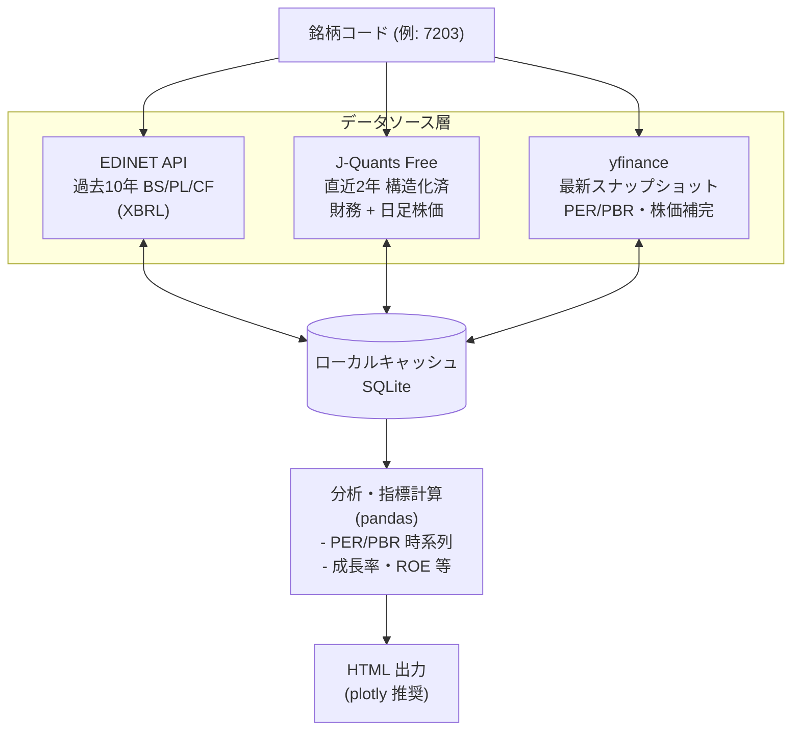

# 日本株 個別分析基盤 - 情報源予備調査

調査日: 2026-05-11
調査範囲: 日本株の銘柄コードから財務データ（BS/PL/CF、PER/PBR等の指標、過去推移）を**完全無料**で取得するための情報源。Pythonでの実装・HTML出力を前提とする。

---

## 1. 結論サマリ

| # | 情報源 | 種類 | 過去データ | PER/PBR | BS/PL/CF | 推奨度 |
|---|--------|------|----------|---------|----------|--------|
| 1 | **EDINET API** | 公的（金融庁） | 10年分 | × (要計算) | ◎ (XBRL) | ★★★ 一次情報 |
| 2 | **J-Quants API (Free)** | 公的（JPX） | 2年分・12週遅延 | △ (要計算) | ◎ (構造化済) | ★★★ 構造化済 |
| 3 | **yfinance** | OSS（非公式） | 4年程度 | ◎ (info) | ○ (年次/四半期) | ★★ 手軽さ重視 |
| 4 | Alpha Vantage | 海外API | 限定的 | △ | △ | ★ 日本株は弱い |
| 5 | Finnhub | 海外API | × (Free枠外) | × | × | × Free枠で日本株不可 |

**推奨構成**: `EDINET API`（一次情報・10年分BS/PL/CF）＋ `J-Quants API Free`（構造化された決算指標・株価）＋ `yfinance`（最新スナップショット・補完）の3点併用。

---

## 2. 各情報源の詳細

### 2.1 EDINET API（金融庁）★★★

- **URL**: https://disclosure2dl.edinet-fsa.go.jp/guide/static/disclosure/WZEK0110.html
- **仕様書**: [EDINET API 仕様書 Version 2 (2026年4月)](https://disclosure2dl.edinet-fsa.go.jp/guide/static/disclosure/download/ESE140206.pdf)
- **料金**: 完全無料（API key登録のみ必要）
- **レート制限**: 1日100リクエストまで（仕様書要再確認）
- **データ形式**: XBRL（構造化された財務報告書）、PDF
- **対象書類**: 有価証券報告書、四半期報告書、半期報告書、大量保有報告書、適時開示等
- **過去データ**: 最大10年分

**取得できる情報**:
- 貸借対照表（BS）、損益計算書（PL）、キャッシュフロー計算書（CF）の全勘定科目
- 従業員情報、平均給与
- 大株主情報、役員報酬
- セグメント情報

**Python実装**:
- 公式SDKは無し。`requests` + XBRL parser（`Arelle`, `python-xbrl`, 自作）で実装
- 参考: [EDINET API使い方 - lifetechia](https://lifetechia.com/edinet-api-1/)

**メリット**: 一次情報・改ざんなし・全項目取得可能・無料・長期データ
**デメリット**: XBRLパースが必要で実装コスト高。指標（PER/PBR等）は自前で計算する必要あり

---

### 2.2 J-Quants API（JPX）★★★

- **URL**: https://jpx-jquants.com/
- **Free プラン仕様**: https://jpx-jquants.com/ja/spec/data-spec
- **料金**: 無料（要会員登録、メール認証）
- **レート制限**: 5リクエスト/分（Free）
- **データ形式**: JSON（構造化済）

**Freeプランで取得できるもの**:
- 上場銘柄一覧
- 株価四本値（日足、12週間遅延、過去2年分）
- 財務情報（`/fins/statements`、12週間遅延、過去2年分）
  - DisclosedDate、BookValuePerShare、Equity、EquityToAssetRatio、EarningsPerShare 等
- 決算発表予定日（直近のみ）
- 配当情報（1株配当、配当利回り）

**Python実装**:
- 公式の使いやすいSDKは無いがREST APIシンプル
- 参考: [J-Quants API 入門（V2対応） - zenn](https://zenn.dev/shimada_ml/articles/6df909a5a96268)
- 2026年1月のV2でAPIキー認証に統一

**メリット**: 公式・構造化済で実装が楽・株価と財務がワンストップ
**デメリット**: Freeは12週遅延（最新四半期は取れない）・過去2年のみ

---

### 2.3 yfinance（Yahoo Finance 非公式ラッパー）★★

- **PyPI**: `pip install yfinance`
- **ティッカー**: 日本株は末尾 `.T`（例: トヨタ `7203.T`）
- **料金**: 完全無料・登録不要

**取得できる情報**:
- 株価ヒストリカル: `Ticker("7203.T").history(period="10y")`
- スナップショット指標: `stock.info["trailingPE"]`, `stock.info["priceToBook"]`, `currentPrice`, `marketCap` 等
- 財務三表: `Ticker().balance_sheet`, `Ticker().financials`, `Ticker().cashflow`（年次/四半期、概ね直近4期）
- 配当: `Ticker().dividends`
- セクター・業種

**メリット**: セットアップ最小・銘柄コード指定のみで多項目取得・PER/PBR最新値が即座に取れる
**デメリット**:
- **PER/PBRは「現在値スナップショット」のみで時系列履歴は取れない**（時系列が必要ならEDINET/J-Quantsで自前計算）
- データ品質が低く欠損・異常値あり（要バリデーション）
- Yahoo側仕様変更でいきなり壊れることがある
- 非公式・利用規約のグレーゾーン
- 信用・空売りデータは無し

参考:
- [yfinanceで取得できるデータ項目まとめ - Qiita](https://qiita.com/zundalab/items/3b806c1fb3303956fd7b)
- [yfinanceだけで日本株分析 - note](https://note.com/botter_01/n/nbbec5830cc17)

---

### 2.4 Alpha Vantage ★

- **URL**: https://www.alphavantage.co/
- **料金**: Free 500リクエスト/日
- **日本株**: TSE銘柄に部分対応するが、財務（fundamentals）は米国株中心
- **Free枠**: ほぼ全エンドポイント利用可能、テクニカル指標も豊富

**評価**: 日本株のfundamentals（BS/PL/CF）取得は不安定との情報あり。為替・米国株向け。日本株分析の主軸には不向き。

---

### 2.5 Finnhub ✕

- **URL**: https://finnhub.io/
- **料金**: Free 60リクエスト/分（寛大）
- **日本株 fundamentals**: **Premiumプラン（$11.99〜）でのみ利用可**

**評価**: Free枠は米国株中心で、日本株の財務データは取得できない。今回の用途では対象外。

---

## 3. 推奨アーキテクチャ案

**役割分担の提案**:
- **EDINET**: 過去長期の財務三表詳細（一次情報・改ざんなし）
- **J-Quants Free**: 構造化された決算指標と日足株価（実装が楽）
- **yfinance**: 最新のPER/PBR/時価総額（J-Quants Freeの12週遅延を補う）
- **ローカルDB（SQLite等）**: API呼び出しのキャッシュ。レート制限対策

---

## 4. 次ステップ候補

1. **EDINET APIのアカウント取得 + XBRLパーサーの選定**（`Arelle` vs `python-xbrl` の比較）
2. **J-Quants Free登録 + 株価・財務取得の動作確認**
3. **yfinance での簡易プロトタイプ**（最も実装が早い）
4. ローカルキャッシュ層（SQLite）の設計
5. HTML可視化ライブラリ選定（`plotly` 推奨：インタラクティブ、`pandas.DataFrame.to_html` で軽量出力も可）

---

## 5. 参考リンク

### EDINET
- [EDINET API 仕様書 Version 2](https://disclosure2dl.edinet-fsa.go.jp/guide/static/disclosure/download/ESE140206.pdf)
- [EDINET API関連資料](https://disclosure2dl.edinet-fsa.go.jp/guide/static/disclosure/WZEK0110.html)
- [EDINET APIの使い方 - lifetechia](https://lifetechia.com/edinet-api-1/)
- [EDINET APIを利用して企業情報（XBRL）を集める - Qiita](https://qiita.com/XBRLJapan/items/27e623b8ca871740f352)

### J-Quants
- [J-Quants API公式](https://jpx-jquants.com/)
- [プランごとに利用可能なAPIとデータ期間](https://jpx-jquants.com/ja/spec/data-spec)
- [J-Quants API 入門（V2対応）- zenn](https://zenn.dev/shimada_ml/articles/6df909a5a96268)
- [J-Quants APIで決算データを無料取得する - note](https://note.com/craftechlife/n/n6ab92b895c12)

### yfinance
- [yfinance取得データ項目まとめ - Qiita](https://qiita.com/zundalab/items/3b806c1fb3303956fd7b)
- [yfinanceだけで日本株分析 - note](https://note.com/botter_01/n/nbbec5830cc17)

### 海外API
- [Alpha Vantage](https://www.alphavantage.co/)
- [Finnhub API Documentation](https://finnhub.io/docs/api)
- [日本株 API比較記事 - SystemTrade](https://systemtrade.blog/posts/restapi)
