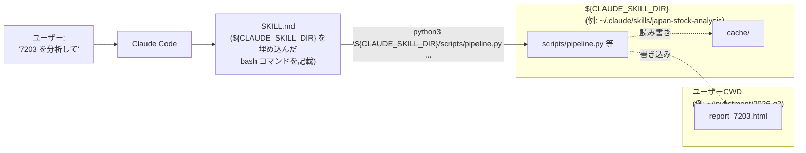

# QA: Skill の起動方法 — 公式推奨は `${CLAUDE_SKILL_DIR}` 絶対パス

作成日: 2026-05-21
更新: ユーザー指摘により公式仕様を再確認、結論を入れ替え。

---

## 結論（先に書く）

**Claude Code Agent Skills の公式推奨パターンは `${CLAUDE_SKILL_DIR}` 環境変数を
使った絶対パス呼び出し**。SKILL.md は次のように書くのが標準:

```bash
python3 ${CLAUDE_SKILL_DIR}/scripts/pipeline.py analyze --sec-code 7203
```

`${CLAUDE_SKILL_DIR}` は Claude Code が SKILL.md 実行時に自動でセットする
環境変数で、その Skill の SKILL.md が置かれているディレクトリの絶対パスが入る。
パーソナル (`~/.claude/skills/`) / プロジェクト (`./.claude/skills/`) / プラグイン
配下のどこに Skill があっても透過的に解決される。

公式ドキュメントの説明:

> `${CLAUDE_SKILL_DIR}` — The directory containing the skill's `SKILL.md` file.
> Use this in bash injection commands to reference scripts or files bundled
> with the skill, regardless of the current working directory.

これにより、**実行時の CWD はユーザーのプロジェクトディレクトリのまま**で、
スクリプト本体は Skill ルートを起点に絶対パスで叩ける。
plan §3.4 が想定していた「成果物は CWD」「キャッシュは Skill 内」が
そのまま両立する。

ご指摘の通り、これが Agent Skills の本来の使い方でした。
私が当初書いた init_plan.md §4.3 のコマンド例 (`python -m scripts.pipeline`) は
Skill の慣習を踏まえておらず、誤りでした。修正します。

---

## 1. もともと何が問題だったか

`python -m scripts.pipeline` は **CWD を sys.path に追加**する Python の仕様に
依存する。これだと:

- Skill ルートを CWD にしないと `scripts` パッケージが解決できない
- でも CWD を Skill ルートにすると、`paths.output_dir() == Path.cwd()` の都合で
  成果物が Skill 内に落ちる
- 結局「Skill 内に成果物が貯まる」か「ImportError で落ちる」の二択になる

これは `python -m` を使ったから生じた問題で、**`python /absolute/path/to/scripts/pipeline.py` で呼べば
そもそも起きない**。

---

## 2. 公式パターンに合わせるとどうなるか

### SKILL.md（Claude が読む手順書）の書き方

```markdown
## 4. 実行手順

分析:
\`\`\`bash
python3 ${CLAUDE_SKILL_DIR}/scripts/pipeline.py analyze --sec-code 7203
\`\`\`

初回 bootstrap:
\`\`\`bash
python3 ${CLAUDE_SKILL_DIR}/scripts/bootstrap.py fetch-documents --years 10
\`\`\`

キャッシュ情報:
\`\`\`bash
python3 ${CLAUDE_SKILL_DIR}/scripts/cache_admin.py info
\`\`\`
```

CWD はユーザーのプロジェクトディレクトリのまま。成果物 (`report_7203.html`)
はそのプロジェクトに落ちる。キャッシュは `${CLAUDE_SKILL_DIR}/cache/` に貯まる。

### スクリプト側で必要な対応

現状は各 `scripts/*.py` が **相対 import** (`from . import paths`) を使っている。
これは `python -m scripts.pipeline` でしか動かない書き方。

公式パターンに合わせるには、**スクリプトを単一ファイルとしても実行できるように、
スクリプト先頭で Skill ルートを sys.path に挿入**する必要がある。

```python
# 各サブコマンド系スクリプト (pipeline.py, bootstrap.py, cache_admin.py) の先頭:
import sys
from pathlib import Path
# Allow running both as `python scripts/pipeline.py` (direct) and as
# `python -m scripts.pipeline` (module). When run directly, add the Skill
# root to sys.path so that `from scripts...` imports resolve.
if __package__ in (None, ""):
    sys.path.insert(0, str(Path(__file__).resolve().parent.parent))
    from scripts import paths  # noqa: E402
    # ... (re-route other imports through scripts.* form)
```

これだと両方の呼び方が動くが、書き方がやや trick っぽい。よりクリーンには
**相対 import (`from . import paths`) を絶対 import (`from scripts import paths`)
に統一**し、スクリプト先頭で sys.path 調整を入れる方法がある。後者が公式パターンと
親和的。

### 採用する方針（推奨）

各スクリプトを以下の形にする:

```python
#!/usr/bin/env python3
"""..."""
from __future__ import annotations

# Make this script runnable both as `python pipeline.py ...` (direct, the
# Skill convention) and `python -m scripts.pipeline ...` (module form, for
# tests). When run directly, __package__ is empty — add Skill root to sys.path.
if __package__ in (None, ""):
    import sys
    from pathlib import Path
    sys.path.insert(0, str(Path(__file__).resolve().parent.parent))

from scripts import paths
from scripts.config import ConfigError, load_edinet_config
# ... (絶対 import に統一)
```

両方の呼び方が動く理由:
- `python scripts/pipeline.py` で呼ぶと `__package__` が空 → sys.path 調整が走る
  → `scripts.paths` が解決できる
- `python -m scripts.pipeline` で呼ぶと `__package__ == "scripts"` → sys.path 調整は
  スキップ → 通常通り `scripts.paths` を解決
- pytest 実行時はモジュール扱いになるので影響なし

---

## 3. 何を直すか

1. `scripts/pipeline.py`, `scripts/bootstrap.py`, `scripts/cache_admin.py` の3つを
   「**$CLAUDE_SKILL_DIR から直接叩ける形**」に書き換える:
   - 相対 import → 絶対 import
   - 先頭に sys.path 調整スニペット
2. `init_plan.md §4.3` のコマンド例を `python -m scripts.X` から
   `python ${CLAUDE_SKILL_DIR}/scripts/X.py` に書き換え
3. `README.md` の動作確認コマンドも書き換え
4. SKILL.md は P8 で正式に書くので、P3 では雛形のコメント差し替えだけ
5. 動作確認: ユーザーの任意 CWD から呼んで成果物が CWD に落ちることを再検証

---

## 4. 図



CWD はユーザーのプロジェクトディレクトリのまま、スクリプト本体は絶対パスで
解決される。`paths.output_dir() == Path.cwd()` がそのまま意図通りに働く。

---

## 5. 確認事項

このまま「公式 `${CLAUDE_SKILL_DIR}` 方式」に書き換えて P3 をクローズしてよいか、
ご確認お願いします。

- スクリプト 3 つ (pipeline / bootstrap / cache_admin) の絶対 import 化と
  sys.path スニペット追加
- init_plan.md §4.3 と README.md のコマンド例書き換え
- ユーザー任意 CWD からの動作再検証

ラッパースクリプト (`jsa`) は不要。SKILL.md が `${CLAUDE_SKILL_DIR}` を
使う前提の bash を書けばよい。

---

## 6. 参考

- [Extend Claude with skills - Claude Code Docs](https://code.claude.com/docs/en/skills)
- [Agent Skills - Claude API Docs](https://platform.claude.com/docs/en/agents-and-tools/agent-skills/overview)
- [anthropics/skills (公式サンプルレポ)](https://github.com/anthropics/skills)
